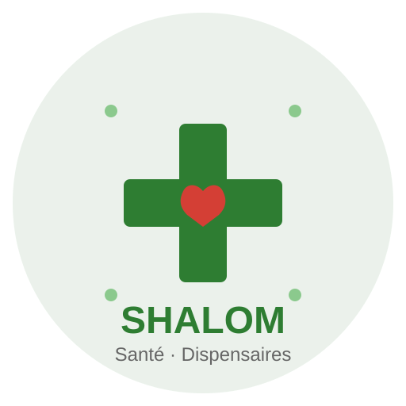

# Shalom DHIS2 - Branding Assets

Ce dossier contient tous les assets de branding pour l'application Shalom DHIS2.

## 🚀 Quick Start

### Générer tous les assets PNG

```bash
npm install
npm run generate
```

### Nettoyer et régénérer

```bash
npm run regenerate
```

## 📁 Contenu

- `logos/` - Logo principal, mark/icône, version monochrome
- `icons/` - Favicons et app icons en différentes tailles
- `splash/` - Splash screens pour mobile
- `badges/` - Badges pour les trois départements (Maternité, Pédiatrie, Médecine Générale)
- `social/` - Images pour réseaux sociaux

## 📖 Documentation

Pour la documentation complète sur l'utilisation, les couleurs, les proportions et l'intégration:

**→ [LOGO_GUIDELINES.md](./LOGO_GUIDELINES.md)**

## 🎨 Aperçu

### Logo Principal


Le logo représente une croix médicale (symbole de santé) avec un cœur au centre (compassion et soin), entouré d'éléments décoratifs.

### Couleurs
- **Vert Principal**: `#2E7D32` (santé, nature, vie)
- **Rouge Cœur**: `#E53935` (passion, soin, urgence)
- **Vert Accent**: `#4CAF50` (croissance, espoir)

## 🔧 Maintenance

Pour modifier le logo:
1. Éditer le fichier SVG maître dans `logos/`
2. Exécuter `npm run regenerate`
3. Mettre à jour les applications (mobile et web)
4. Tester sur tous les supports

## 📞 Support

Consultez [LOGO_GUIDELINES.md](./LOGO_GUIDELINES.md) pour toute question.
